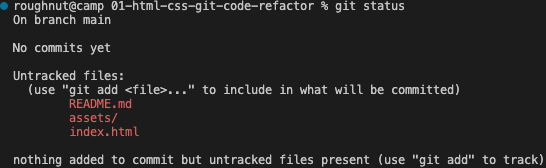
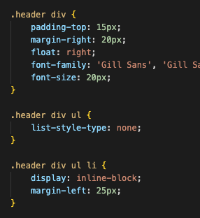

# Bootcamp Challenge 01 - HTML, CSS and Git: Code Refactor

On-the-job ticket challenge to refactor starter code for a mock-marketing agency website.

## Description

Horeiseon marketing agency have requested their website be refactored to meet current accessibility standards so that:

1. People with disabilities can access the site using assistive technologies, and
2. The site can rank higher on Google and other search engines

The [User Story](#user-story) and [Acceptance Criteria](#acceptance-criteria) are below.

I describe the process for completing the challenge and my learnings in the [Process & Learnings](#process-learnings) section.

(just learned how to do a Markdown anchor :raised_hands: & emoji syntax too! :raised_hands:).


<a id="user-story"></a>
## User Story

```
AS A marketing agency
I WANT a codebase that follows accessibility standards
SO THAT our own site is optimized for search engines
```


<a id="acceptance-criteria"></a>
## Acceptance Criteria

```
GIVEN a webpage meets accessibility standards
WHEN I view the source code
THEN I find semantic HTML elements ✅
WHEN I view the structure of the HTML elements
THEN I find that the elements follow a logical structure independent of styling and positioning ✅
WHEN I view the icon and image elements
THEN I find accessible alt attributes ✅
WHEN I view the heading attributes
THEN they fall in sequential order ✅
WHEN I view the title element
THEN I find a concise, descriptive title ✅
```
## Usage

NOTE: The completed site is [deployed to Github pages](https://roughnut.github.io/bootcamp-challenge-01-html-css-git-code-refactor/ "link to deployed site on Github pages").

<a id="process-learnings"></a>
## Process and Learnings

In Week 1 of Bootcamp one of our learnings was Git, including how to initialise local repositories. Challenge files were already pulled (git pull) from our coursework repo on Gitlab. The files include starting assets (images & CSS) and an index.html. I created my README.md file locally too.

1. Create local directory
```
mkdir ~/bootcamp/challenges/01-html-css-git-code-refactor/
```

2. Copy challenge files to new directory + create new README (this one)
```
cp assets -R ~/bootcamp/challenges/01-html-css-git-code-refactor/
cp index.html ~/bootcamp/challenges/01-html-css-git-code-refactor/
touch README.md
```

3. Initialise local Git repo
```
git init
```
Not to mention using the following pretty much after every git command:
```
git status
```
Which in this case outputs:



(just learned how to add an image to a markdown file :raised_hands:)

4. Add untracked files to staging for the next commit
```
git add README.md index.html assets/
```

5. Then commit changes to the local repo
```
git commit -m "initial commit"
```

6. Then had to hit up (or should that be "git up") Github to create a remote repo: [Bootcamp Challenge 01 - HTML, CSS & Git: Code Refactor](git@github.com:roughnut/bootcamp-challenge-01-html-css-git-code-refactor.git)

7. Then connect the local repo to the remote
```
git remote add origin git@github.com:roughnut/bootcamp-challenge-01-html-css-git-code-refactor.git
```

8. Then push the local repo
```
roughnut@camp 01-html-css-git-code-refactor % git push -u origin main
Enumerating objects: 19, done.
Counting objects: 100% (19/19), done.
Delta compression using up to 8 threads
Compressing objects: 100% (18/18), done.
Writing objects: 100% (19/19), 47.64 MiB | 2.14 MiB/s, done.
Total 19 (delta 1), reused 0 (delta 0), pack-reused 0
remote: Resolving deltas: 100% (1/1), done.
To github.com:roughnut/bootcamp-challenge-01-html-css-git-code-refactor.git
 * [new branch]      main -> main
branch 'main' set up to track 'origin/main'.
roughnut@camp 01-html-css-git-code-refactor % git pull
Already up to date.
```
:raised_hands:

Time to jump into the user story and acceptance criteria...

9. First cab off the rank is the HTML elements need to be semantic <br>
`GIVEN a webpage meets accessibility standards` <br>
`WHEN I view the source code` <br>
`THEN I find semantic HTML elements` <br>
but a review of the index.html source code shows very few semantic elements:

    1. Update Line 11 - the header from <br> `<div class="header">` to `<header class="header">`
    2. Update Line 13 - an unordered list for navigation purposes from <br> `<div>` to `<nav>`
    3. Update Line 27 - a hero background image from <br> `<div class="hero">` to `<section class="hero">`
    4. Update Line 28 - a container for the primary services offered by Horiseon from <br> `<div class="content">` to `<main class="content">`
    5. Update Lines 29, 36 and 43 - containers for communicating the details of each service to clients from <br> `<div id="...">` to `<section id="...">`
    6. Update Line 51 - a sidebar container from <br> `<div class="benefits">` to `<aside class="benefits">`
    7. Update Lines 52, 59, 66, the sidebar sections from <br> `<div class="...">` to `<section class="...">`
    8. Update Line 74, the footer from <br> `<div class="footer">` to `<footer class="footer">`

10. Next <br>
`GIVEN a webpage meets accessibility standards` <br>
`WHEN I view the structure of the HTML elements` <br>
`THEN I find that the elements follow a logical structure independent of styling and positioning` <br>
Beyond the `html` and `head` tags, the elments below follow a logical structure

11. Next <br>
`GIVEN a webpage meets accessibility standards` <br>
`WHEN I view the icon and image elements` <br>
`THEN I find accessible alt attributes` <br>
<br>None of the images or icons have `alt="..."` attributes to help assisitive technologies describe them to disabled users. <br>
`alt="..."` attributes were added to the following lines in the source code: <br>
Line 30: `alt="notebook on a desk"` <br>
Line 37: `alt="person working on a laptop computer"` <br>
Line 43: `alt="top down view of a desk with people working around it"` <br>
Line 54: `alt="icon of a lead generation funnel` <br>
Line 61: `alt="icon of a glowing light bulb"` <br>
Line 68: `alt="icon of coins and a cogwheel"` <br>

12. Next <br>
`GIVEN a webpage meets accessibility standards` <br>
`xWHEN I view the heading attributes` <br>
`THEN they fall in sequential order` <br>

In the source code the `h1` tag is nested in the `header` the `h2` tags are nested in the `main` tag and the `h3` tags are nested in the `aside` so they fall in sequential order <br>

13. Next <br>
`GIVEN a webpage meets accessibility standards` <br>
`WHEN I view the title element` <br>
`THEN I find a concise, descriptive title` <br>

The existing title tag `<title>website</title>` isn't very descriptive now, is it? Let's update it to: <br>
`<title>Horiseon | Digital Marketing Agency</title>`

That takes care of the [User Story](#user-story) and [Acceptance Criteria](#acceptance-criteria) <br>

14. The updates to the HTML have broken parts of the CSS as the `<div>` selectors have been changed, in the example below, to `<nav>` selectors <br>
 <br>
which is causing the following behaviour on the site <br>
 <br>
Also the CSS property values defined in pixels, for example `padding: 20px;` are not responsive so will cause UX issues on different screen sizes, so those values should be changed to percentages, for example `padding: 3%;`

15. The CSS style file is extensively commented to discuss the edits.

16. Thank you! :pray: :raised_hands:


        

